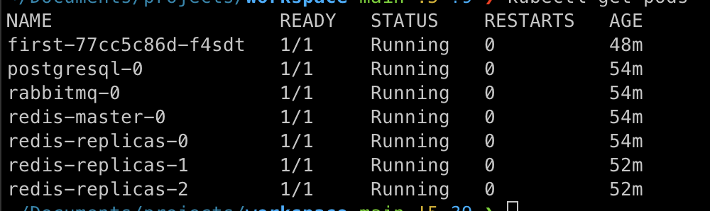

# Quick start

Since the Microservice Stack is based on NX, NX project setup is required. If this is your first time working with NX, please read the docs [here](https://nx.dev/getting-started).


To create a new NX project use the following command:

```
 npx create-nx-workspace@latest
```

After running the command you will be presented with an interactive shell. To use the Microservice Stack, the following configuration is suggested when going through the interactive shell:


Once the NX project is configured you can install the Microservice Stack by running the following command:

```
npm i --save-dev @microservice-stack/workspace
```

This NPM package will add our workspace generator plugin to your NX project. The workspace generator includes generators for services, libraries, and deployment configuration.

Once the workspace generator is installed, you can proceed to configure the Microservice Stack using the following command:

```
nx generate @microservice-stack/workspace:configuration-generator
```

This command will generate the default deployment configuration with helm charts and add NPM packages that are required for generators to work.

With configuration generated, you can now generate your first service by running the following command:

```
nx generate @microservice-stack/workspace:application-generator --applicationName=service
```

This command will generate service files that you can see located inside the `apps/api/service` folder and service specific libraries located in `libs/api/service` folder.

With the service generated you can now run the service using NX serve command

```
nx run api-service:serve
```

The service will be run on the port `80` and you can access it using the `http://localhost/v1/service` url.

To make use of the deployment configuration, you can deploy the service inside the local Kubernetes cluster using our local deployment CLI tool.&#x20;

To use the CLI, you need to have the following services installed and accessible by CLI

* Minikube ([https://minikube.sigs.k8s.io/docs/start/](https://minikube.sigs.k8s.io/docs/start/))
* Docker ([https://docs.docker.com/get-docker/](https://docs.docker.com/get-docker/))
* Helm ([https://helm.sh/docs/intro/install/](https://helm.sh/docs/intro/install/))
* Kubectl ([https://kubernetes.io/docs/tasks/tools/](https://kubernetes.io/docs/tasks/tools/))

When all CLI requirements are met, you can create your deployment using the following command:

```
npx @microservice-stack/local-deployment@latest install
```

This will configure minikube, install postgres, redis and rabbitmq applications and deploy all services you have created to the cluster.

After the installation is finished, you can check the deployment using the following command:

```
kubectl get pods
```

The response should look something like this



While all the services are running, you are not able to access them yet because the ingress controller hasn't been set up yet. To set up the ingress controller you first have to add a route to its configuration. The ingress configuration is located inside the `infrastructure/ingress-values.yaml`.

When you were generating the first service earlier, a default endpoint `v1/service` was added. We can add this endpoint to the ingress by using the following template:

```yaml
endpoints:
  - serviceName: '{serviceName}-service'
    path: '/v1/service'
```

After inserting the service name, it should look something like

```yaml
endpoints:
  - serviceName: 'service-service'
    path: '/v1/service'
```

After the endpoint is added to the configuration, you can run the following command to deploy the updated ingress configuration to the cluster:

```
npx @microservice-stack/local-deployment@latest update-ingress
```

With ingress controller deployed, you should now have an entry point to your cluster configured. To access your cluster, you should expose the ingress controller using `kubectl port-forward` command.

To do that, you first have to find out your ingress controller pod name. You can do that by running the following command:

```typescript
kubectl -n ingress-nginx get pods
```

The response should look something like this

.png>)

Now that we have the ingress controller name, we can use the port-forward command to expose the cluster to port 80 using the following command

```
kubectl -n ingress-nginx port-forward <controller pod name> 80:80
```

The service should now be accessible using `http://localhost/v1/service` url.
